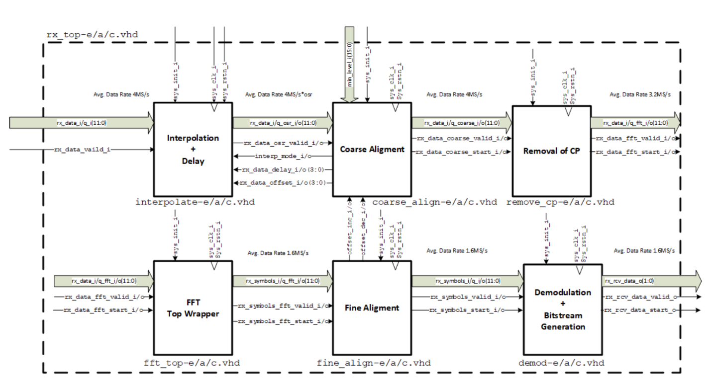

# OFDM RX Path in VHDL

This repository aims to create an OFDM RX implementation according to [this specification](doc/OFDM_Rx_Specification.pdf). An overview of the architecture can be obtained from the following figure.

## TopLevel Simulation
### Requirements
- Mentor Modelsim or Questa
- Python3 (added to the PATH environment variable)
- Python modules: numpy and matplotlib (`pip install numpy matplotlib`)

### How to start
Just call the script `start_rx_simulation.bat <command>` where `command` is one of the following:
- `gui`: Starts the simulation in GUI mode (useful for wave window debugging)
- `cmd`: Starts the simulation in command line mode
- `clean`: Cleans all the simulation artifacts

There is also a bash script with the same name and commands.
